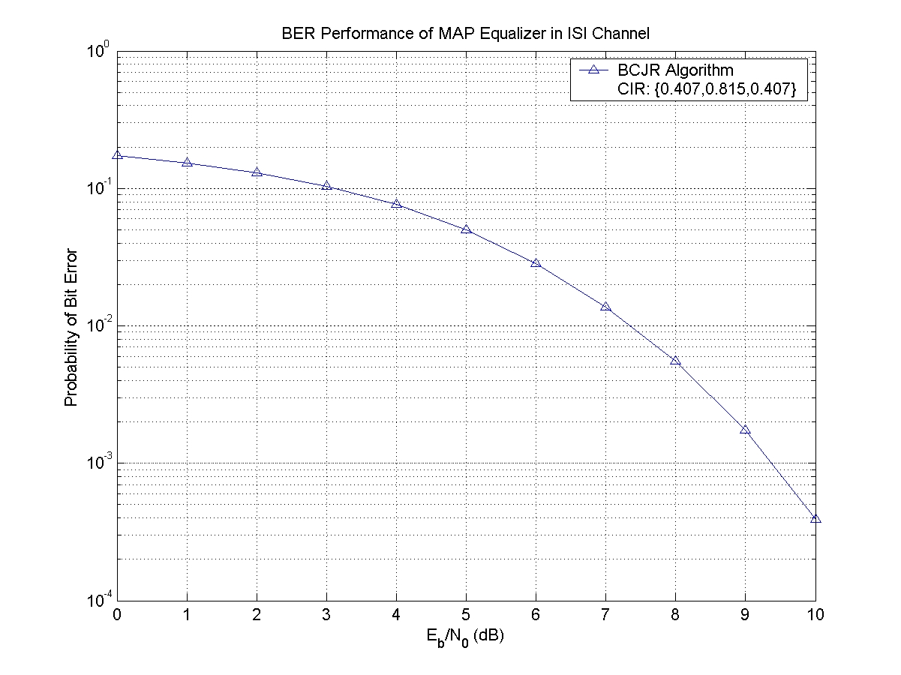
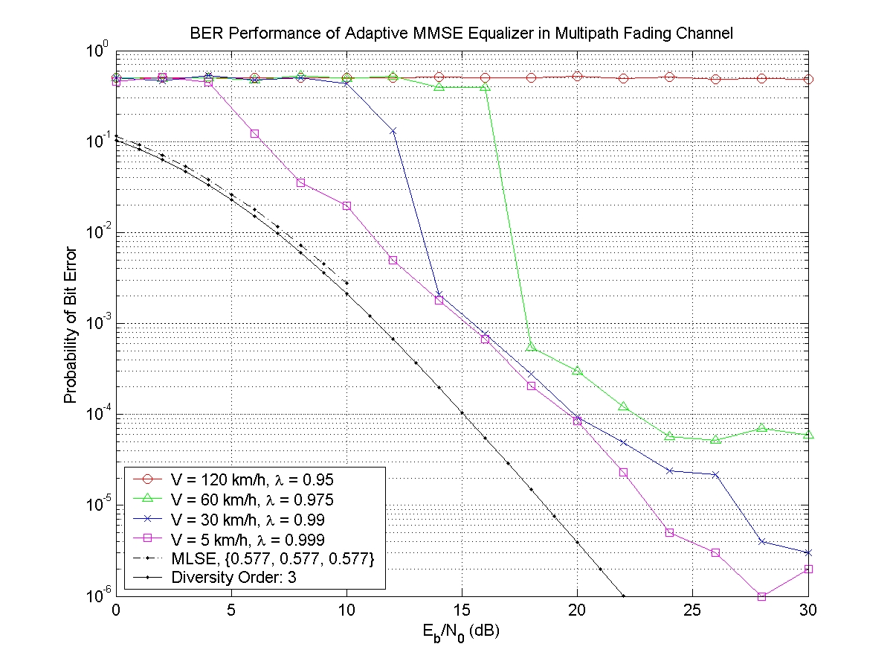
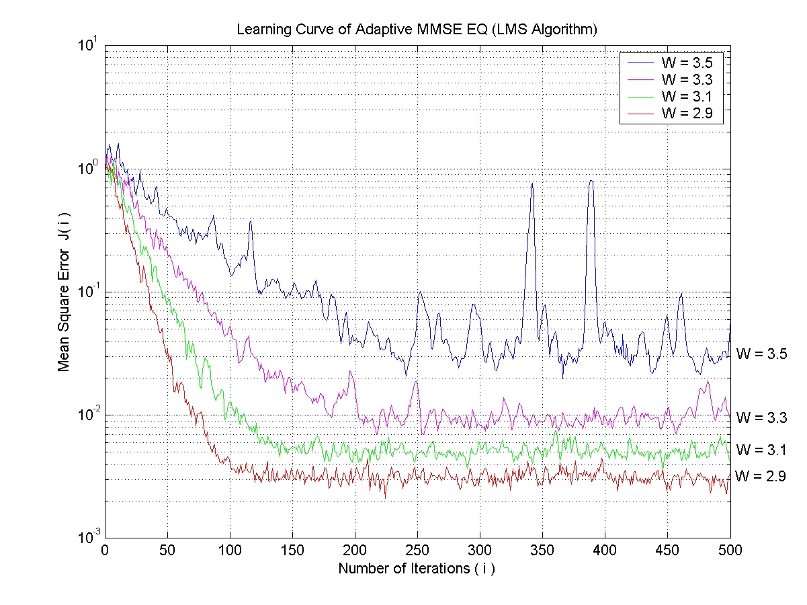
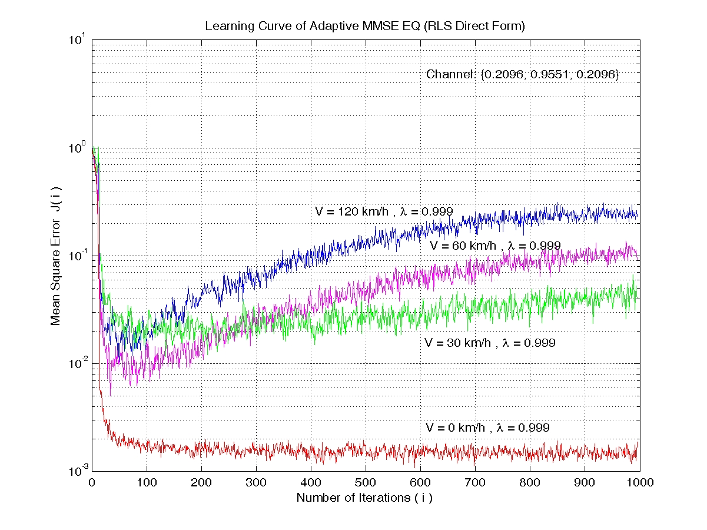
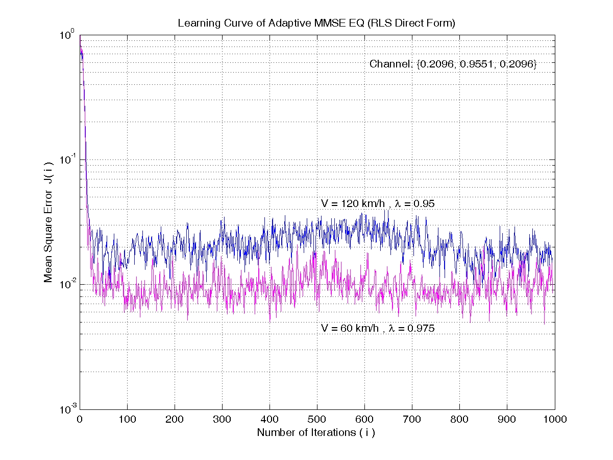
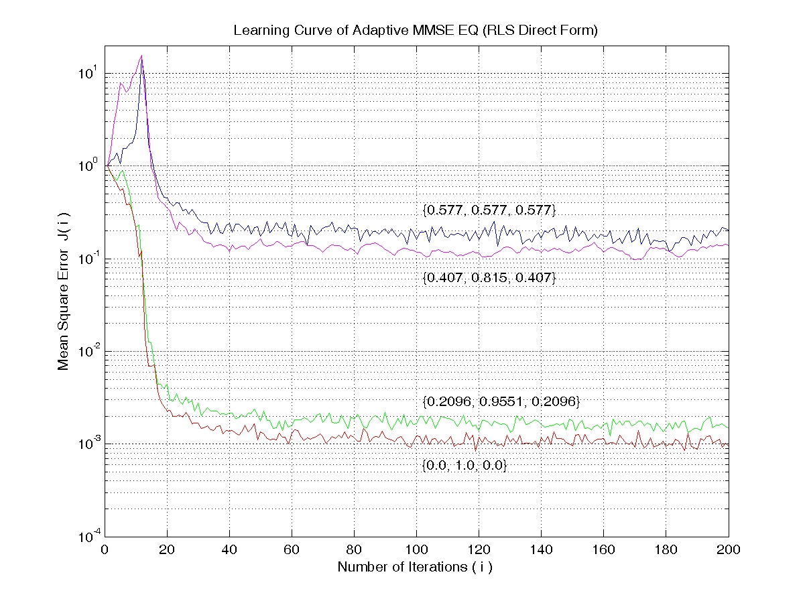

### Adaptive Equalizer Performance Evaluation

* MAP Equalizer (BCJR Algorithm)
* MLSE Equalizer (Maximum Likelihood Sequence Estimator, Soft Output Viterbi Algorithm)
* Adaptive MMSE Equalizer: Least Mean Square (LMS) Algorithm
* Adaptive MMSE Equalizer (Kalman Filter): Recursive Least Squares (RLS) Algorithm
* ISI Channel: Channel impulse response {0.407, 0.815, 0.407} 
* Fading Channel: 3-path Rayleigh fading channel with equal strength (Jakes Model) 

#### Performance Evaluation

